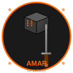

# hp-41_amar


<br clear="left"/>

[](https://en.wikipedia.org/wiki/HP-41C)
[](https://unlicense.org/)
[](https://github.com/isene/hp-41_amar/stargazers)
[](https://isene.org)

## HP-41: Tools for the Amar Role-Playing Game

Two essential tools from the [Amar RPG](http://d6gaming.org) brought to the HP-41 calculator:
- **O6**: Open-ended D6 dice roller
- **Random Encounter Generator**: Generate encounters for your Amar campaigns

### O6 - Open-Ended Dice Roller

The O6 dice system is unique to Amar RPG. It works like this:

1. Roll a six-sided die
2. **If you roll a 6**: Roll again. If 4-6, add 1 and keep rolling
3. **If you roll a 1**: Roll again. If 1-3, subtract 1 and keep rolling
4. **Special results**:
   - Two consecutive 6s = **CRITICAL**
   - Two consecutive 1s = **FUMBLE**

Results can range from negative numbers to theoretically unlimited positive values.

**Usage:**
- Press **A** from the main menu to roll O6
- The result is displayed along with any critical/fumble indication

### Random Encounter Generator

Generate random encounters based on terrain type, time of day, and level modifier.

**Terrain Types:**
```
0 = City       4 = Hills
1 = Rural      5 = Mountains
2 = Road       6 = Woods
3 = Plains     7 = Wilderness
```

**Encounter Types:**
- Small Animal
- Large Animal
- Human
- Dwarf
- Elf
- Arax
- Monster
- Event
- No Encounter

**Attitudes:**
- Hostile
- Antagonistic
- Neutral
- Positive
- Friendly

**Usage:**

1. **Set terrain and conditions** (Press **a**):
   - Choose terrain type (0-7)
   - Set day (1) or night (0)
   - Set level modifier (-5 to +5 typically)

2. **Generate encounter** (Press **B**):
   - Shows number of opponents
   - Shows encounter attitude
   - Shows encounter type

## Main Menu

Upon **XEQ "AMAR"**, you get this menu:

```
O6 R:E a:T *
```

Pressing **R/S** shows terrain settings:

```
D/N LV= TER=
```

**Menu Keys:**

Label | Menu | Description
------|------|------------
LBL A | O6   | Roll an open-ended D6
LBL B | R:E  | Generate random encounter
LBL a | a:T  | Set terrain, day/night, and level
LBL E | *    | Return to menu

## Program Structure

The program consists of two files:

1. **amar.41**: Main program with O6 roller and encounter generator
2. **amar_data.41**: Alpha data for encounter types and attitudes

## How It Works

### O6 Dice Roller
- Uses RAN# for random number generation
- Tracks consecutive rolls for critical/fumble detection
- Stores result in register 01
- Uses registers 02 and 03 for critical/fumble flags

### Encounter Generator
- Uses weighted probability tables for each terrain type
- Different probabilities for day vs. night encounters
- Number of opponents determined by O6 roll
- Attitude determined by standard D6 roll
- Stores settings in registers 10-13
- Uses indirect execution for terrain-specific tables

### Probability Tables

Each terrain has unique encounter probabilities. For example:
- **City (Day)**: 31% Human, 16% Event, 10% Small Animal, 5% No Encounter
- **Wilderness (Night)**: 29% Large Animal, 23% Monster, 8% No Encounter

The program implements all 16 terrain/time combinations from the Amar Tools.

## Requirements

- HP-41C/CV/CX or compatible (DM-41X, HP-41CL)
- Uses registers 01-16
- User-defined keys enabled (SF 27)

## Installation

1. Load both **amar.41** and **amar_data.41** into your HP-41
2. Ensure both are in the same memory space
3. Execute **XEQ "ENCDAT"** once to initialize encounter data
4. Execute **XEQ "ATTDAT"** once to initialize attitude data
5. Run **XEQ "AMAR"** to start

## Example Session

```
XEQ "AMAR"
→ "AMAR RPG TOOLS"
→ "V 1.0"
→ "O6 R:E a:T *"

Press a (set terrain)
→ "TERRAIN 0-7?" 6 (Woods)
→ "DAY(1) NIGHT(0)" 0 (Night)
→ "LEVEL MOD?" 2

Press B (generate encounter)
→ "NUM=3"
→ "ATTITUDE:"
→ "HOSTILE"
→ "TYPE:"
→ "LARGE ANIMAL"

Press A (roll O6 for initiative)
→ "8"
```

## Tips for Game Masters

1. **Pre-set terrain**: Use label 'a' before the session to set typical terrain
2. **Quick rolls**: Assign O6 to a key for fast initiative/skill checks
3. **Level modifier**: Adjust based on party level (-3 for weak, +3 for tough)
4. **Multiple encounters**: Press B repeatedly for different encounters
5. **Attitude modifier**: Adjust based on party actions and situation

## Differences from Full Amar Tools

This HP-41 version provides the core encounter generation functionality:
- **Included**: Encounter type, number, attitude determination
- **Not included**: Full NPC stat generation, equipment, spells, names
- **Simplified**: Basic encounter info to speed up gameplay

For full NPC generation with complete statistics, use the [Amar Tools](https://github.com/isene/Amar-Tools) on your computer.

## Links

- [Amar RPG Website](http://d6gaming.org)
- [Amar Tools (Full Version)](https://github.com/isene/Amar-Tools)
- [O6 Implementations](https://github.com/isene/O6)

## License

This software is released into the Public Domain.
